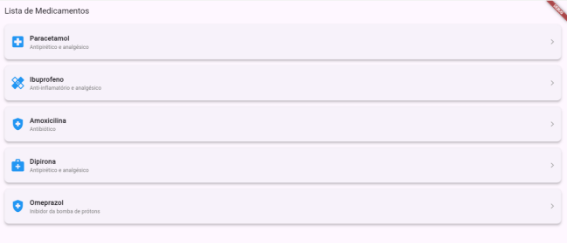
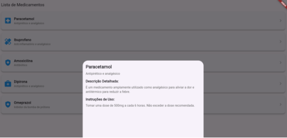

**Conhecendo os Widgets Flutter (Lista de Remédios)**

Criei uma lista de remédios a partir de uma classe simples com objetos de medicamentos, armazenando os remédios em uma lista. 

Utilizei alguns widgets do Flutter para personalizar o estilo dos itens na lista, inclui um Card para cada item da lista, adicionar ícones para representar categorias ou estados dos remédios e melhorar a aparência com padding, bordas e cores. A interface é simples, com o AppBar exibi o título "Lista de Medicamentos", e o corpo da tela é preenchido com a lista de medicamentos.

Para exibir mais detalhes na mesma tela quando o usuário clicar em um item da lista, podemos utilizar um **balão de informações,** que aparece diretamente na tela sem a necessidade de navegar para uma nova página. Isso pode ser feito com um showModalBottomSheet, que cria um painel na parte inferior da tela, com mais informações sobre o medicamento. Isso permitirá que você mostre os detalhes sem sair da tela atual.

**Lista de Widgets utilizados:**

- **ListView.builder:**
  Usamos o widget ListView.builder para criar uma lista dinâmica. Ele percorre a lista de medicamentos e cria um ListTile para cada item. Cada ListTile exibe o nome e a descrição do medicamento.

- **Card:**
  Cada item da lista é agora envolvido em um widget Card, que ajuda a criar uma caixa com sombra, tornando a UI mais moderna e agradável. Também foi adicionado um elevation para dar uma leve elevação, criando um efeito de profundidade.

- **Padding:**

  Utilizado para envolver o widget filho e adicionar umespaço interno (em pixels ou outras unidades) entre o widget e suas bordas.

- **Scaffold:**

  É um widget fundamental que fornece a estrutura básica para construir um layout visual típico de um aplicativo. Ele fornece uma estrutura de design comum, como barras de navegação (AppBar), corpo da tela (Body), botões de navegação (FloatingActionButton), menus de navegação (Drawer), entre outros...

- **StatelessWidget:**

  É um tipo de widget que **não tem estado mutável**. Ou seja, ele é usado para criar interfaces onde o conteúdo do widget não muda ao longo do tempo.

**Tela com a Lista de Medicamentos:**

**Balão com informações detalhadas:**

